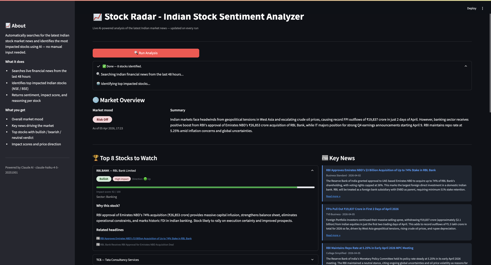

# 📡 StockRadar

An autonomous AI-powered tool that scans the latest Indian stock market news and returns **buy / sell / hold** sentiment verdicts for the most impacted stocks — with zero manual input.

---

## 🚀 What it does

1. Searches live Indian finance news from the last 48 hours using Claude AI + web search
2. Identifies the top impacted NSE/BSE stocks automatically — no watchlist needed
3. Returns structured sentiment analysis per stock:
   - **Bullish / Bearish / Neutral** sentiment
   - **High / Medium / Low** impact rating
   - **Impact score** (1–100)
   - **Price direction** (up / down / sideways)
   - **Reasoning** grounded in real news
4. Displays a market mood overview and key news feed

---

## StockRadar Screenshot


## 🗂 Project Structure

```
stock_sentiment/
├── app.py          # Streamlit frontend
├── analyzer.py     # Claude API call + JSON parsing
├── config.py       # All settings (API key, model, token limits)
├── requirements.txt
└── README.md
```

---

## ⚙️ Setup

### 1. Clone the repo

```bash
git clone https://github.com/your-username/StockRadar.git
cd StockRadar
```

### 2. Install dependencies

```bash
pip install -r requirements.txt
```

### 3. Get an Anthropic API key

- Go to [https://console.anthropic.com](https://console.anthropic.com)
- Sign up and add credits (minimum $5)
- Go to **Settings → API Keys** and create a new key

### 4. Add your API key

- create .env file under the project ROOT and place your api key as below:
ANTHROPIC_API_KEY=sk-ant-your-api-key


### 5. Run the app

```bash
streamlit run app.py
```

Open your browser at `http://localhost:8501`

---

## 🧪 Test backend only (no UI)

```bash
python analyzer.py
```

This runs the analysis and saves a JSON report to the current directory.

---

## 🔧 Configuration

All settings are in `config.py`:

| Variable | Default | Description |
|----------|---------|-------------|
| `ANTHROPIC_API_KEY` | `""` | Your Anthropic API key |
| `MODEL` | `claude-haiku-4-5-20251001` | Claude model to use |
| `MAX_TOKENS` | `6000` | Max tokens for Claude response |
| `TOP_STOCKS` | `8` | Number of stocks to return per run |
| `LOOKBACK_HOURS` | `48` | How recent the news should be |

To get more stocks, just change `TOP_STOCKS`:
```python
TOP_STOCKS = 10
```

---

## 💡 How it works

```
User clicks "Run Analysis"
        ↓
analyzer.py sends one prompt to Claude API
        ↓
Claude uses built-in web_search tool internally
        ↓
Searches Indian finance news (ET, Moneycontrol, BS, CNBC, Reuters etc.)
        ↓
Analyzes and returns structured JSON
        ↓
app.py parses and renders the dashboard
```

Single API call per run — no RSS feeds, no external scraping, no extra dependencies.

---


## ⚠️ Disclaimer

This tool is for **informational purposes only**. The analysis is AI-generated from publicly available news and does not constitute financial advice. Always consult a SEBI-registered financial advisor before making investment decisions.

---

## 🤝 Contributing

Pull requests welcome. For major changes, open an issue first.

---
